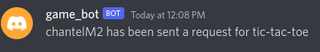
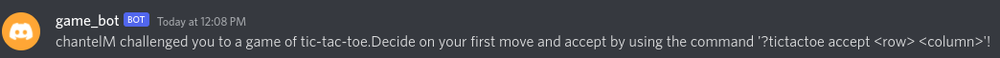
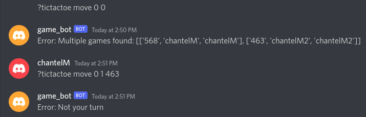

# ChantelM-project0

Discord Bot for playing Tic-Tac-Toe with a
Client-Server LAN to store game objects

- [ChantelM-project0](#chantelm-project0)
- [About the Project](#about-the-project)
  - [Purpose & Goal](#purpose--goal)
  - [Frameworks](#frameworks)
  - [Project Structure](#project-structure)
- [Setup & Deployment](#setup--deployment)
  - [Prerequisites](#prerequisites)
  - [Setup](#setup)
  - [Deployment](#deployment)
- [Usage](#usage)
  - [General information](#general-information)
    - [?help](#help)
    - [?help tictactoe](#help-tictactoe)
  - [Bot Commands](#bot-commands)
    - [?tictactoe challenge @[member]](#tictactoe-challenge-member)
    - [?tictactoe deny](#tictactoe-deny)
    - [?tictactoe accept [row] [column]](#tictactoe-accept-row-column)
    - [?tictactoe move [row] [column]](#tictactoe-move-row-column)
      - [Mutiple Games Handling](#mutiple-games-handling)
    - [?tictactoe quit](#tictactoe-quit)
    - [?tictactoe autoplay](#tictactoe-autoplay)

# About the Project

## Purpose & Goal

Bots on Discord are known as a useful tool for automating tasks. To reduce the
robotic feel of automated introductions, game_bot breaks the ice by facilitating
a game of TicTacToe between 2 server members.

The created Discord bot (game_bot) communicates with a server over a local area network.
The server provides persistent game data storage by maintaining all instances of a game
along with associated players' data.

## Frameworks

Below is a list of frameworks used in this project.

- [discord.py](https://discordpy.readthedocs.io/en/stable/)
  - [Bot Commands Framework](https://discordpy.readthedocs.io/en/stable/ext/c
    - ommands/index.html)
- [unittest](https://docs.python.org/3/library/unittest.html)

## Project Structure

# Setup & Deployment

## Prerequisites

- [Discord Developer Portal Application](https://discord.com/developers/docs/getting-started)
  - Application token
- Remember to [invite the bot to a server](https://discord.com/developers/docs/getting-started#configuring-a-bot)

## Setup

1. Use your application's token and fill in the specified items in [ExampleEnv.txt](ExampleEnv.txt)
2. Rename ExampleEnv.txt to .env
3. Install requirements: `pip install -r requirements.txt`

## Deployment

1. ./app.sh

- automates client and server startup if all tests pass

2. termination instructions
   - `ctrl+c` will terminate the client (game_bot)
   - `sudo fuser -k PORT/tcp` will terminate the server
     - Replace PORT with the same PORT value specified in the .env file
     - Note: fuser -k will kill all processes on the port specified

# Usage

Every command is prefixed with a `?`

## General information

### ?help

### ?help tictactoe

## Bot Commands

### ?tictactoe challenge @[member]

A private message is sent to the initiator confirming the mentioned member has been notified. 
 
The member challenged to a game receives a private message with information on how to accept. 
and initiate game play by making the first move. 

### ?tictactoe deny

Allows the individual challenged to deny the game request. Confirmation of notification is sent to the individual denying the request. 
 
The individual who requested a game receives the below message: 

### ?tictactoe accept [row] [column]

The member challenged to a game of tictactoe can accept by including the first move. 

### ?tictactoe move [row] [column]

Allows a player to place a marker in the requested row and column position. 
 
Both players will receive a message with the state of the current board.

#### Mutiple Games Handling

Should a player be involved with multiple games, game_bot will respond with a list of game ids and the associated players.
From this list, a user can tack on the desired game id at the end of a command to specify.  

### ?tictactoe quit

Allows any player to quit the game. Both players are sent the following message. 

### ?tictactoe autoplay

This command signals to the server to produce a completed game of Tic Tac Toe. 

